# KadGlobe 🌍

[Español](README.md) | [English](README_EN.md)

**KadGlobe** es una herramienta de visualización avanzada en 3D para la red [Kademlia](https://es.wikipedia.org/wiki/Kademlia) en [eMule](https://es.wikipedia.org/wiki/EMule). Permite monitorizar en tiempo real la salud de la red, la distribución geográfica de los nodos y la topología lógica (distancia XOR) de tu tabla de enrutamiento.

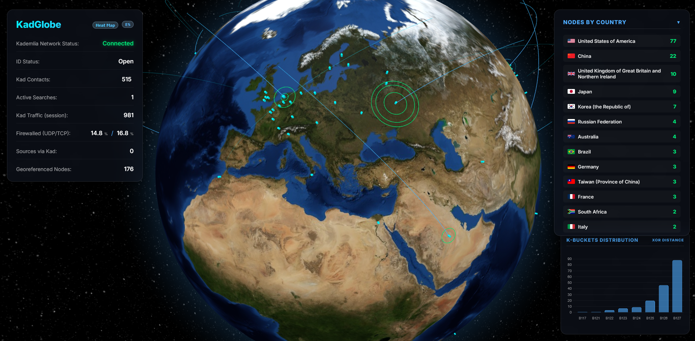

### 1. Descripción General
KadGlobe actúa como un "puesto de mando" visual para eMule. Se conecta a la WebUI de eMule para extraer estadísticas en vivo y analiza archivos de configuración locales (`key_index.dat` y `nodes.dat`) para proyectar tu vecindario Kademlia sobre un globo terráqueo interactivo. Su objetivo es ofrecer transparencia sobre cómo funciona el enrutamiento descentralizado y cuál es el estado real de tus conexiones.

### 2. Tecnologías y Arquitectura
El proyecto se divide en un backend de orquestación y un frontend de visualización premium:

*   **Backend (Python)**:
    *   **Scraper Avanzado**: Inicia sesión en la WebUI de eMule para capturar telemetría (tráfico, búsquedas, estado UDP), y guarda los datos en un archivo JSON.
    
    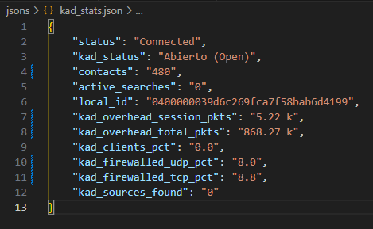

    *   **Extracción de Identidad**: Lee directamente el Kad ID de 128 bits desde `key_index.dat`.
    *   **Geolocalización**: Procesa `nodes.dat` y utiliza una base de dato IP2Location para situar cada nodo de la red en el mapa, y guarda los datos en un archivo JSON.

    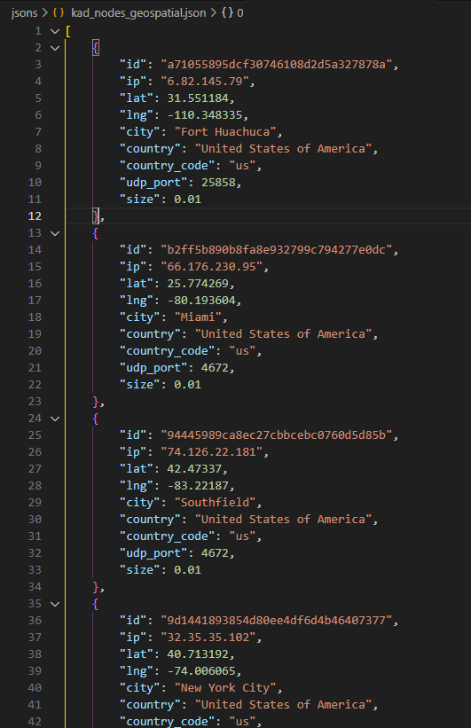
    
    *   **ICMP Pinger**: Realiza _ping sweeps_ (pasando por el SO) para medir la latencia real (RTT, _Round-Trip Time_) de los nodos, y guarda los datos en un archivo JSON.

    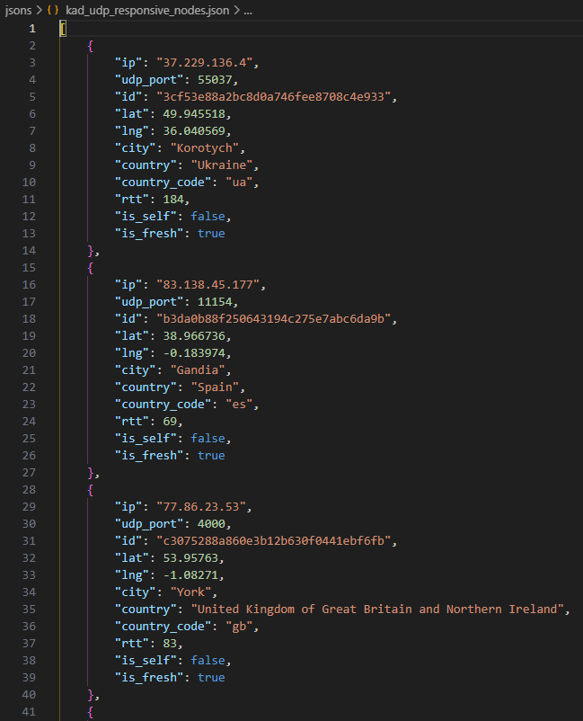
    

*   **Frontend (Web)**:
    *   **Visualización 3D**: Basado en **Globe.gl** y **Three.js** para un renderizado fluido del planeta.
    *   **Interfaz Glassmorphism**: Diseño moderno con efectos de cristal y desenfoque.
    *   **Gráficos**: Utiliza **Chart.js** para representar la distribución de K-Buckets.

### 3. Componentes y Funcionalidades

*   **Mapa Térmico (Heat Map)**: Al activarlo, el sistema realiza pings en tiempo real. Los nodos se colorean: Verde (<150ms), Amarillo (<500ms), Rojo (>500ms) o Blanco (sin respuesta), permitiendo ver qué nodos tienen mejor conectividad contigo a nivel global y en tiempo real.

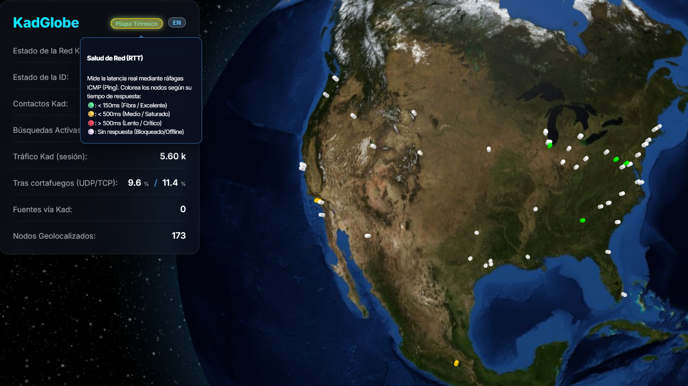

*   **Nodos por País**: Un panel lateral que clasifica y ordena los nodos por ubicación geográfica.

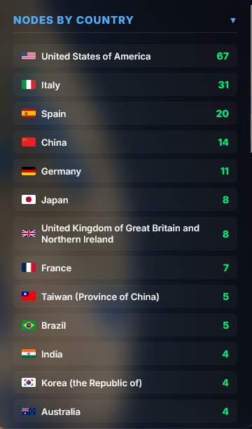

*   **Distribución K-Buckets**: Un histograma que muestra cuántos "contactos" (nodos) tienes en cada "cubo" de enrutamiento (distancia XOR 0-128). Es normal ver más nodos en los buckets lejanos (122-128) y muy pocos en los cercanos (<=121).

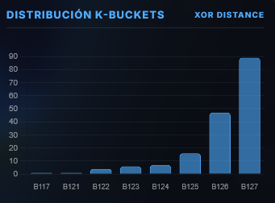

*   **Top 10 Vecindario XOR**: Al hacer clic en un nodo, se muestra una ventana con su IP, su ubicación y  su Kad ID. También se se calculan sus 10 vecinos más cercanos criptográficamente (distancia XOR) y se trazan arcos dorados de conexión.

Por ejemplo, para el nodo de Londres:
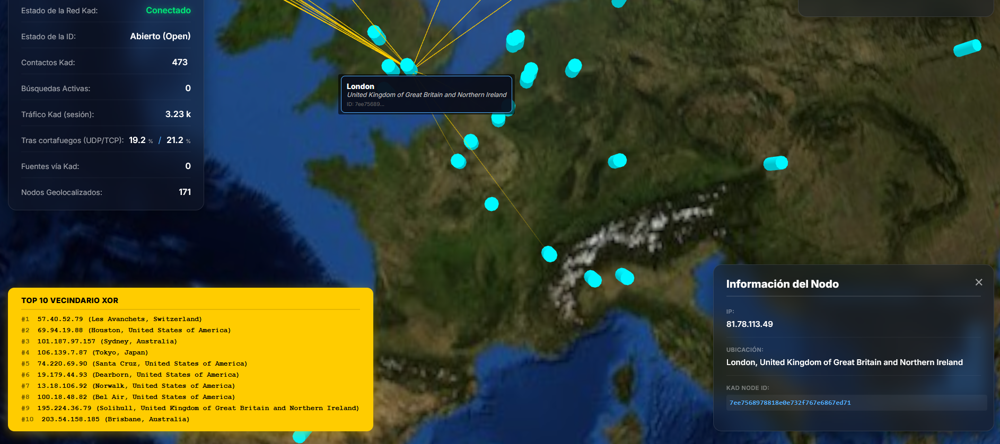
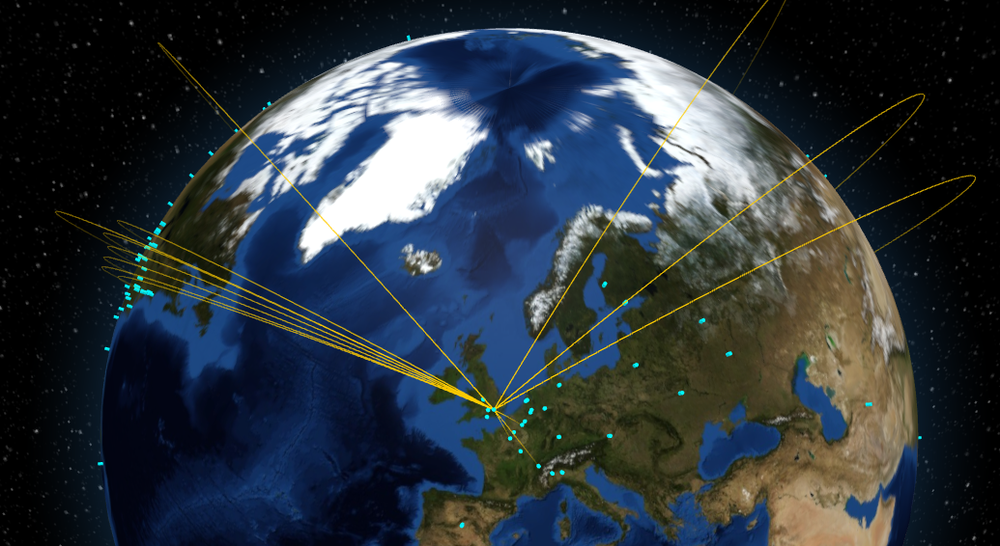

*   **Estado de la ID (Kad Status)**: Diferencia entre estado "Abierto (Open)" y "Tras cortafuegos (Firewalled)" usando terminología específica de Kademlia.

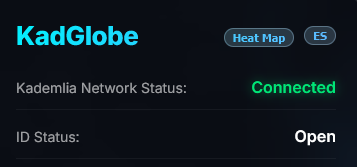
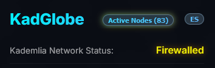
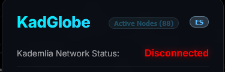

### 4. Requisitos y Configuración
Para que KadGlobe funcione correctamente, debes configurar los siguientes puntos:

1.  **eMule WebUI**: Debes tener activada la "Interfaz Web" en las opciones de eMule (Opciones -> Opciones Adicionales o Interfaz Web según versión) y establecer una contraseña de administrador.

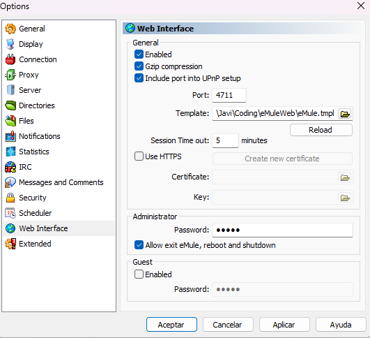

2.  **Dependencias**: Instala los módulos de Python necesarios:
    ```bash
    pip install -r requirements.txt
    ```
3.  **Variables de Entorno**: Configura el archivo `.env` (puedes copiar de `.env.windows.example` o `.env.linux.example` según tu sistema) con tus rutas locales:
    *   `ADMIN_PASS`: La contraseña que pusiste en la WebUI de eMule.
    *   `EMULE_NODES_DAT_PATH`: Ruta completa a tu archivo `nodes.dat` (ej: `C:\eMule\config\nodes.dat`).
    *   `EMULE_KEY_INDEX_PATH`: Ruta a tu archivo `key_index.dat`.
    *   `IP2LOCATION_DB_PATH`: Ruta a la base de datos `.BIN` de IP2Location para la geolocalización.

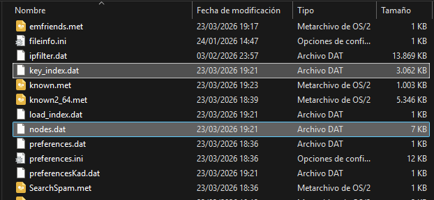
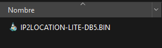

### 5. _Aclaración sobre la Latencia y Persistencia de Datos_

_Es necesario aclarar que la información de los nodos visualizada en KadGlobe se obtiene mediante el análisis (_parsing binario_) del archivo `nodes.dat`, extraído del almacenamiento local del usuario_.

_En el protocolo Kademlia, la **tabla de enrutamiento activa** (los "buckets") se gestiona directamente en la memoria del sistema (RAM) del proceso de eMule para garantizar la máxima velocidad. eMule vuelca estos datos al disco duro (al `nodes.dat`) solo de forma periódica o durante un cierre controlado para mantener la persistencia entre sesiones._

_Por lo tanto, mientras que las estadísticas de tráfico y el estado de UDP sí se capturan en tiempo real a través del _scrapeo_ de la WebUI de eMule, las posiciones geográficas y las distancias XOR representan una "foto" reciente de tus vecinos en la red Kad, en lugar de una transmisión en tiempo real con precisión de milisegundos. Esta decisión de diseño se tomó para ofrecer una forma no invasiva de auditar el estado de la red sin los riesgos de estabilidad asociados con el acceso directo a la memoria ("memory hooking") o la inyección de procesos invasivos._

---

# Automatización

### 1. Configuración Inicial (Recomendado)
El proyecto incluye un **script de configuración** que automatiza la instalación de dependencias, asegura que la estructura de carpetas sea correcta y te ayuda a descargar la base de datos de IP2Location.

**Windows**: Haz doble clic en [setup.bat](https://github.com/floatingbit23/KadGlobe/blob/main/setup.bat).  
**Linux**: Ejecuta `./setup.sh` en tu terminal.

```bash
# Dar permisos de ejecución (solo la primera vez)
chmod +x setup.sh

# Ejecutar el asistente de configuración
./setup.sh
```

### 2. Ejecución de KadGlobe
Una vez configurado, puedes lanzar todos los componentes en un solo paso:

**Windows**: Ejecuta [Script.bat](https://github.com/floatingbit23/KadGlobe/blob/main/Script.bat).  
**Linux**: Ejecuta [launcher.sh](https://github.com/floatingbit23/KadGlobe/blob/main/launcher.sh).

> [!CAUTION]
> **NO ejecutes `launcher.sh` con `sudo`.**  
> Ejecutarlo como root provocará errores de "Permiso denegado" en `/run/user/0` y errores de pantalla (X11) ya que las aplicaciones gráficas como aMule deben correr en tu sesión de usuario normal.

> [!IMPORTANT]
> **Permisos de red en Linux**: Para usar el "Mapa Térmico" (ICMP Ping) en Linux, debes dar permisos a Python para abrir _Raw Sockets_:
> ```bash
> sudo setcap cap_net_raw+ep $(readlink -f $(which python3))
> ```
