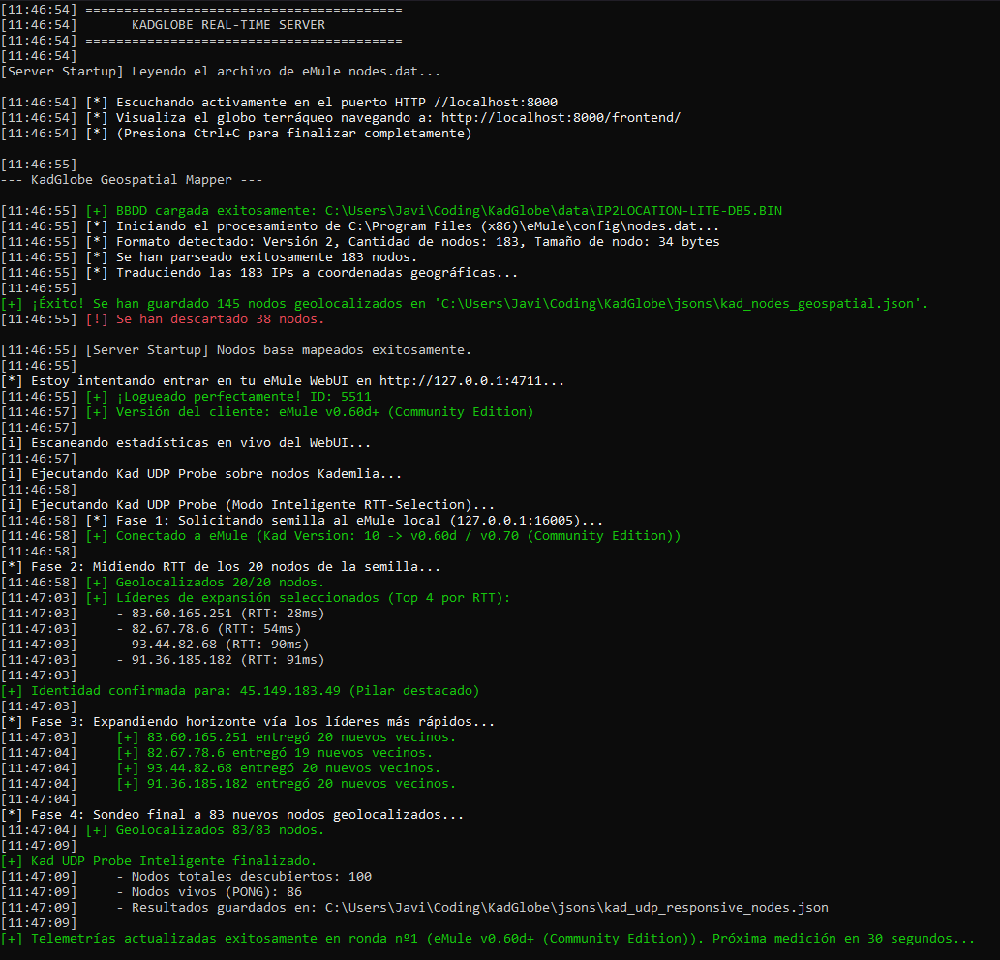
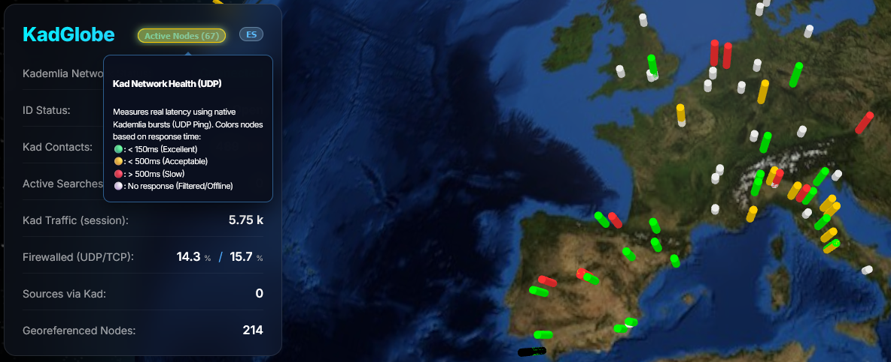
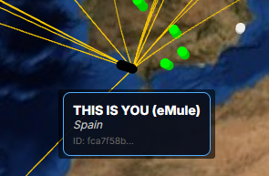

# KadGlobe 🌍

[Español](README.md) | [English](README_EN.md)

**KadGlobe** es una herramienta de visualización avanzada en 3D para la red [Kademlia](https://es.wikipedia.org/wiki/Kademlia) en [eMule](https://es.wikipedia.org/wiki/EMule). Permite monitorizar en tiempo real la salud de la red, la distribución geográfica de los nodos y la topología lógica (distancia XOR) de tu tabla de enrutamiento.




### 1. Descripción General
KadGlobe actúa como un "puesto de mando" visual para eMule. Se conecta a la WebUI de eMule para extraer estadísticas en vivo y analiza archivos de configuración locales (`key_index.dat` y `nodes.dat`) para proyectar tu vecindario Kademlia sobre un globo terráqueo interactivo. Su objetivo es ofrecer transparencia sobre cómo funciona el enrutamiento descentralizado y cuál es el estado real de tus conexiones.

### 2. Tecnologías y Arquitectura
El proyecto se divide en un backend de orquestación y un frontend de visualización premium:

*   **Backend (Python)**:
    *   **Scraper Avanzado**: Inicia sesión en la WebUI de eMule para capturar telemetría (tráfico, búsquedas, estado UDP), y guarda los datos en un archivo JSON.
    
    

    *   **Identidad Dinámica**: Detecta automáticamente tu IP pública y extrae tu KadID real de 128 bits directamente desde el tráfico UDP de tu eMule local.

    *   **Geolocalización**: Procesa `nodes.dat` y utiliza una base de dato IP2Location para situar cada nodo de la red en el mapa.
    
    
    
    *   **Kad UDP Probe Inteligente**: Implementa un motor de descubrimiento en 4 fases:

        1. **Semilla (_Seed_)**: Obtiene contactos del eMule local.

        2. **Selección RTT**: Mide la latencia y selecciona a los **4 nodos más rápidos**.

        3. **Crawl 1-hop**: Solicita contactos a esos líderes para expandir el mapa con nodos vivos de alta calidad (hasta un máximo de 100 nuevos nodos).

        4. **Sondeo**: Mide el RTT final e identifica tu propio nodo (Pilar Negro).

    
    

*   **Frontend (Web)**:

    *   **Visualización 3D**: Basado en **Globe.gl** y **Three.js** para un renderizado fluido.

    *   **Interfaz Bilingüe**: Soporte completo para Español e Inglés mediante un selector dinámico (_ES/EN_).

    *   **Contador en Tiempo Real**: El botón de "Nodos Activos" muestra el número exacto de nodos que respondieron detectados en el último ciclo.

    *   **Gráficos**: Utiliza **Chart.js** para representar la distribución de K-Buckets.

### 3. Componentes y Funcionalidades

*   **Mapa Térmico Inteligente**: Al activarlo, el sistema realiza un descubrimiento recursivo basado en rendimiento. Los nodos se colorean según su latencia UDP: 
> Verde 🟢 (<150ms),

> Amarillo 🟡 (<500ms), 

> Rojo 🔴 (>500ms) 

> Blanco ⚪ (sin respuesta). 

> Nuestro propio nodo se destaca con un pilar negro ⬛ en el globo.




*   **Nodos por País**: Un panel lateral que clasifica y ordena los nodos por ubicación geográfica.


*   **Distribución K-Buckets**: Un histograma que muestra cuántos "contactos" (nodos) tienes en cada "cubo" de enrutamiento (distancia XOR 0-128). Es normal ver más nodos en los buckets lejanos (122-128) y muy pocos en los cercanos (<=121).


*   **Top 10 Vecindario XOR**: Al hacer clic en un nodo, se muestra una ventana con su IP, su ubicación y  su Kad ID. También se se calculan sus 10 vecinos más cercanos criptográficamente (distancia XOR) y se trazan arcos dorados de conexión.

Por ejemplo, para un nodo cualquiera en Londres:


*   **Estado de la ID (Kad Status)**: Diferencia entre estado "Abierto (Open)" y "Tras cortafuegos (Firewalled)" usando terminología específica de Kademlia.


### 4. Requisitos y Configuración
Para que KadGlobe funcione correctamente, debes configurar los siguientes puntos:

1.  **eMule WebUI**: Debes tener activada la "Interfaz Web" en las opciones de eMule (Opciones -> Opciones Adicionales o Interfaz Web según versión) y establecer una contraseña de administrador.


2.  **Dependencias**: Instala los módulos de Python necesarios:
    ```bash
    pip install -r requirements.txt
    ```
3.  **Variables de Entorno**: Configura el archivo `.env` (puedes copiar de `.env.windows.example` o `.env.linux.example` según tu sistema) con tus rutas locales:
    *   `ADMIN_PASS`: La contraseña que pusiste en la WebUI de eMule.
    *   `WEBUI_PORT`: (Opcional) El puerto de la interfaz web (por defecto `4711`).
    *   `EMULE_NODES_DAT_PATH`: Ruta completa a tu archivo `nodes.dat` (ej: `C:\eMule\config\nodes.dat`).
    *   `IP2LOCATION_DB_PATH`: Ruta a la base de datos `.BIN` de IP2Location para la geolocalización.


### 5. _Aclaración sobre la Latencia y Persistencia de Datos_

_KadGlobe obtiene la información de los nodos de dos fuentes complementarias:_

- _**Nodos base (offline)**: Se obtienen mediante el análisis binario del archivo `nodes.dat` de eMule. Estos contactos representan una "foto" de la tabla de rutas del último cierre de eMule, por lo que las posiciones geográficas y las distancias XOR del mapa base pueden no reflejar el estado actual de la red en tiempo real._

- _**Nodos "frescos" (en vivo)**: Para el Mapa Térmico, KadGlobe envía un `KADEMLIA2_BOOTSTRAP_REQ` directamente al proceso de eMule local para obtener contactos **verificados y activos** de su tabla de rutas en memoria. Esto garantiza que los nodos sondeados están realmente conectados a la red Kad en ese momento._

_Las estadísticas de tráfico y el estado de la conexión se capturan en tiempo real a través del scrapeo de la WebUI de eMule. Las latencias del Heat Map se miden con paquetes `KADEMLIA2_PING/PONG` nativos del protocolo (vía UDP), ofreciendo una medición real a nivel de aplicación — no solo a nivel de red (ICMP)._

_Esta arquitectura permite monitorizar la salud de la red Kademlia de forma no invasiva, sin requerir acceso directo a la memoria ni inyección de procesos._

---

# Automatización

### 1. Configuración Inicial (Recomendado)
El proyecto incluye un **script de configuración** que automatiza la instalación de dependencias, asegura que la estructura de carpetas sea correcta y te ayuda a descargar la base de datos de IP2Location.

**Windows**: Haz doble clic en [setup.bat](https://github.com/floatingbit23/KadGlobe/blob/main/setup.bat).  
**Linux**: Ejecuta `./setup.sh` en tu terminal.

```bash
# Dar permisos de ejecución (solo la primera vez)
chmod +x setup.sh

# Ejecutar el asistente de configuración
./setup.sh
```

### 2. Ejecución de KadGlobe
Una vez configurado, puedes lanzar todos los componentes en un solo paso:

**Windows**: Ejecuta [Script.bat](https://github.com/floatingbit23/KadGlobe/blob/main/Script.bat).  
**Linux**: Ejecuta [launcher.sh](https://github.com/floatingbit23/KadGlobe/blob/main/launcher.sh).


> [!CAUTION]
> **NO ejecutes `launcher.sh` con `sudo`.**  
> Ejecutarlo como root provocará errores de "Permiso denegado" en `/run/user/0` y errores de pantalla (X11) ya que las aplicaciones gráficas como aMule deben correr en tu sesión de usuario normal.
