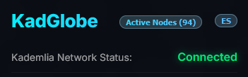

# KadGlobe 🌍

[Español](README.md) | [English](README_EN.md)

## 1. General Overview

**KadGlobe** is an advanced 3D visualization tool for the [Kademlia](https://en.wikipedia.org/wiki/Kademlia) network in [eMule](https://en.wikipedia.org/wiki/EMule). It serves as a visual "command post," connecting to the eMule WebUI to extract live statistics and analyzing local configuration files (`key_index.dat` and `nodes.dat`) to project your Kademlia neighborhood onto an interactive 3D globe. It aims to provide transparency on how decentralized routing works and the real-time health of your connections.


### 2. Technologies and Implementation
The project is built with a robust Python backend and a premium web-based frontend:

*   **Backend (Python)**:

    *   **Advanced Scraper**: Logs into the eMule WebUI to capture telemetry (traffic, searches, UDP status), and saves the data in a JSON file.

    

    *   **Dynamic Identity**: Automatically detects your public IP and extracts your authentic 128-bit KadID directly from local eMule UDP traffic.

    *   **Geolocation**: Processes `nodes.dat` and uses IP2Location databases to place each contact on the map.
    
    
    
    *   **Intelligent Kad UDP Probe**: Implements a 4-phase discovery engine:

        1. **Seed**: Retrieves initial contacts from local eMule.

        2. **RTT Selection**: Measures latency (RTT) and selects the **4 fastest nodes**.

        3. **1-hop Crawl**: Requests neighbors from those leaders to expand the map with high-quality, live nodes (up to a maximum of 100 new nodes).

        4. **Sweep**: Final RTT measurement and self-node identification (Black Pillar).

    

*   **Frontend (Web)**:

    *   **3D Rendering**: Built on **Globe.gl** and **Three.js** for smooth visualization.

    *   **Bilingual UI**: Full support for Spanish and English via a dynamic toggle (ES/EN).

    *   **Real-time Counter**: The "Active Nodes" button displays the exact number of live responders detected in the current cycle.
    
    *   **Analytics**: Uses **Chart.js** to display the K-Buckets distribution.

### 3. Components and Features

*   **Intelligent Heat Map**: When active, the system performs a recursive performance-based discovery. Nodes are color-coded based on their UDP latency: 
> Green 🟢 (<150ms),

> Yellow 🟡 (<500ms), 

> Red 🔴 (>500ms) 

> White ⚪ (no response). 

> Our own node is highlighted with a black pillar ⬛ on the globe.


*   **Nodes by Country**: A sidebar that classifies and sorts your contacts by geographic location.


*   **K-Buckets Distribution**: A histogram showing how many contacts you have in each routing "bucket" (XOR distance 0-128).


*   **Top 10 XOR Neighborhood**: Clicking a node calculates its 10 mathematically closest neighbors and traces golden connection arcs.

As an example, for a random node in London:


*   **ID Status (Kad Status)**: Displays your status in the Kad network, using specific Kademlia terminology.




### 4. Requirements and Setup
To use KadGlobe, you must ensure the following requirements are met:

1.  **eMule WebUI**: The "Web Interface" must be enabled in eMule's options, and an administrator password must be set.


2.  **Dependencies**: Install the required Python modules:
    ```bash
    pip install -r requirements.txt
    ```
3.  **Environment Variables**: Configure the `.env` file (you can copy `.env.windows.example` or `.env.linux.example` depending on your OS) with your local paths:
    *   `ADMIN_PASS`: Your eMule WebUI password.
    *   `WEBUI_PORT`: (Optional) The Web interface port (defaults to `4711`).
    *   `EMULE_NODES_DAT_PATH`: Full path to your `nodes.dat` file.
    *   `IP2LOCATION_DB_PATH`: Path to the IP2Location `.BIN` database file.


### 5. _Disclaimer: Data Latency and Persistence_

_KadGlobe retrieves node information from two complementary sources:_

- _**Base nodes (offline)**: Obtained by binary parsing of eMule's `nodes.dat` file. These contacts represent a "snapshot" of the routing table from eMule's last shutdown, so the geographic positions and XOR distances on the base map may not reflect the current state of the network in real time._

- _**"Fresh" nodes (live)**: For the Heat Map, KadGlobe sends a `KADEMLIA2_BOOTSTRAP_REQ` directly to the local eMule process to obtain **verified, active contacts** from its in-memory routing table. This guarantees that the probed nodes are actually connected to the Kad network at that moment._

_Traffic statistics and connection status are captured in real time via the eMule WebUI scraper. Heat Map latencies are measured using native `KADEMLIA2_PING/PONG` protocol packets (via UDP), providing a true application-level measurement — not just a network-level (ICMP) one._

_This architecture enables non-invasive Kademlia network health monitoring without requiring direct memory hooking or process injection._

---

# Automation

### 1. First Time Setup (Recommended)
The project includes a **setup script** that automates the installation of dependencies, ensures the folder structure is correct, and helps you download the IP2Location database.

**Windows**: Double-click [setup.bat](https://github.com/floatingbit23/KadGlobe/blob/main/setup.bat).  
**Linux**: Run `./setup.sh` in your terminal.

```bash
# Give execution permissions (only first time)
chmod +x setup.sh

# Run the setup wizard
./setup.sh
```

### 2. Launching KadGlobe
Once configured, you can launch all components in a single step:

**Windows**: Run [Script.bat](https://github.com/floatingbit23/KadGlobe/blob/main/Script.bat).  
**Linux**: Run [launcher.sh](https://github.com/floatingbit23/KadGlobe/blob/main/launcher.sh).


> [!CAUTION]
> **DO NOT run `launcher.sh` with `sudo`.**  
> Running as root will cause "Permission Denied" errors in `/run/user/0` and "Display not found" errors because GUI applications like aMule must run within your normal user session.
